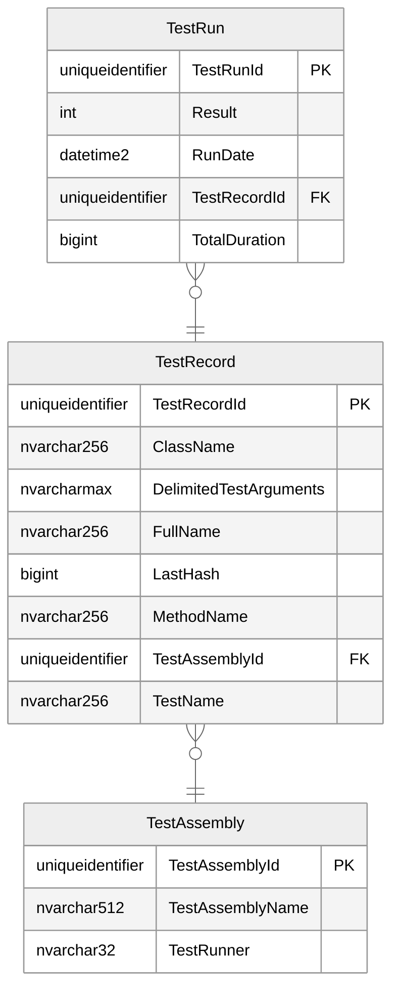

# not-again
<p align="center">

</p>

[](https://github.com/gman-au/not-again/actions/workflows/test.yml)


[Docker image](https://hub.docker.com/repository/docker/gman82/not-again-api)

## Summary
This is a very simple, lightweight API that can be set up to persist test runs in an (SQL Server) database.

Although written with plugins for C#, the API itself is agnostic and can accept check and result submissions from any language / technology.

When integrated with your test project, the API will be queried before each test runs, to determine whether or not it _should_ be run, based on the criteria you have defined.

In CI/CD pipelines and / or large-scale automated test suites, this tool can be useful in minimising continual 're-running' of long tests that are deemed fairly reliable.

For example, you may have several long-running tests that block out the rest of your CI/CD test pipeline, or lengthen the overall testing step(s) by an order of magnitude.

Using the `Not-Again` API, you could conditionally run the test(s) such that:
* If a test has run in the past _X_ days, and passed, then do not re-run it
* If it has been modified since the last run, then re-run it, regardless
* Otherwise, as a failsafe, just re-run it

### Examples
#### Examples of affirmative responses

```mermaid
sequenceDiagram
    My Test->>+Not-Again: Run this test? Threshold is 10 days
    Not-Again->>+Database: Find last test run    
    Note right of Database: No test found
    Note right of Database: Test run found but last run did not pass
    Note right of Database: Test run found but older than 10 days
    rect rgb(64, 95, 45)
    Database-->>-Not-Again: YES
    Not-Again->>-My Test: YES
    end
    Note left of My Test: Run the test
    My Test->>+Not-Again: Test completed with this result
    Not-Again->>-Database: Store this result    
```

#### Examples of negative responses

```mermaid
sequenceDiagram
    My Test->>+Not-Again: Run this test? Threshold is 10 days
    Not-Again->>+Database: Find last test run    
    Note right of Database: Test found and passed, newer than 10 days
    rect rgb(95, 45, 45)
    Database-->>-Not-Again: NO
    Not-Again->>-My Test: NO
    end
    Note left of My Test: Skip the test
```


# Domain model<!--- SIREN_START -->

<!--- SIREN_END -->


# Installation / usage
## Running the API
* This repo contains the entire source code for the API, as well as the domain model and database migrations to set up the required database
* Alternatively, you can also find the API docker image at [this link](https://hub.docker.com/repository/docker/gman82/not-again-api)
* When running either of the above, you will need to pass a single environment variable `ConnectionStrings__NOT-AGAIN` (either via [Docker environment variables](https://docs.docker.com/compose/environment-variables/set-environment-variables/), or `dotnet` runtime variables)
* This value will be the [database connection string](https://www.connectionstrings.com/sql-server/) that the API has access to in order to persist the test data
### Docker command example
```powershell
docker run -d -p 80:80 -e ConnectionStrings__NOT-AGAIN='<MY_DATABASE_CONNECTION_STRING>' gman82/not-again-api:latest
```
<sub>NOTE: you may need to use **single quotes** in the connection string to escape the equals signs.</sub>


# Configuring your tests to use Not-Again
## .NET via NuGet package
### [Not.Again.NUnit](https://www.nuget.org/packages/Not.Again.NUnit/)
* Install the above NuGet package into your test project
* As shown in the [NUnit sample test project](https://github.com/gman-au/not-again/blob/master/src/6.0/Sample.NUnit.Test.Project/BasicTests.cs), add or update your `[SetUp]` and `[TearDown]` methods (which are configured to run prior and after every _test_) to integrate with the Not-Again API:
```C#
[SetUp]
public async Task Setup() => await NotAgain.SetupAsync();

[TearDown]
public async Task Teardown() => await NotAgain.TearDownAsync();

... (the rest of your tests)
```
### Running the tests
When running the tests (i.e. `dotnet test`), the following environment variables will need to be supplied:
* `NOT_AGAIN_URL` - this is the base URL of your `Not-Again` API host e.g. `https://localhost`
* `RERUN_TESTS_OLDER_THAN_DAYS` _(optional)_ - this value specifies the threshold, in days, at which a passing test is deemed 'stale' and should be re-run. Tests with run dates falling _inside_ this threshold will not be re-run.

> [!IMPORTANT]  
> If `RERUN_TESTS_OLDER_THAN_DAYS` is omitted, it will trigger **all** of your tests to re-run, regardless.

So, for example, the following command would pass the above variables through to the testing environment:
```powershell
dotnet test My.Test.Project\My.Test.Project.csproj -e NOT_AGAIN_URL=https://localhost -e RERUN_TESTS_OLDER_THAN_DAYS=30
```

The test logger should provide feedback for each test.

<p align="center">

</p>

## API integration
While the NuGet package above is obviously .NET limited, it is simply a module that simplifies the HTTP requests to the `Not-Again` API; the API itself is not limited to .NET at all, and can accept HTTP requests from any testing platform.

The API has two simple endpoints:
* `/Diagnostic/RunCheck` - HTTP POST expecting a [`RunCheckRequest`](https://github.com/gman-au/not-again/blob/master/src/6.0/Not.Again.Contracts/RunCheckRequest.cs) payload
  * This request returns a [`DiagnosticResponse`](https://github.com/gman-au/not-again/blob/master/src/6.0/Not.Again.Contracts/DiagnosticResponse.cs) payload if successful
* `/Diagnostic/ReportResult` - HTTP POST expecting a [`SubmitResultRequest`](https://github.com/gman-au/not-again/blob/master/src/6.0/Not.Again.Contracts/SubmitResultRequest.cs) payload (does not return a payload)

# Further development
## Analytics dashboard
The domain model, in its current form, is effectively gathering test metrics over time i.e:
* The test characteristics
* How long the test took to run
* The eventual result of the test (pass, fail, inconclusive)
* The run date of the test

With these metrics, there is no reason why future features could not leverage this data into a fully-fledged test analytics / QA dashboard, in the vein of similar paid products:
* [Cypress Cloud](https://www.cypress.io/cloud)
* [Currents.dev](https://currents.dev)
* [Microsoft Playwright Testing](https://azure.microsoft.com/en-au/products/playwright-testing)

In fact, the primary driver for this platform was the absence of a .NET equivalent for the above (I really thought Microsoft Playwright Testing would support .NET!)