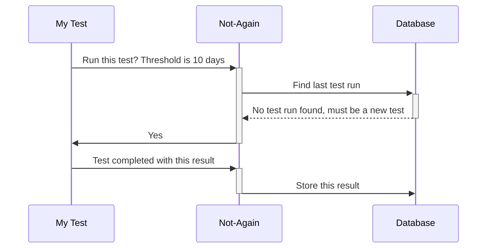
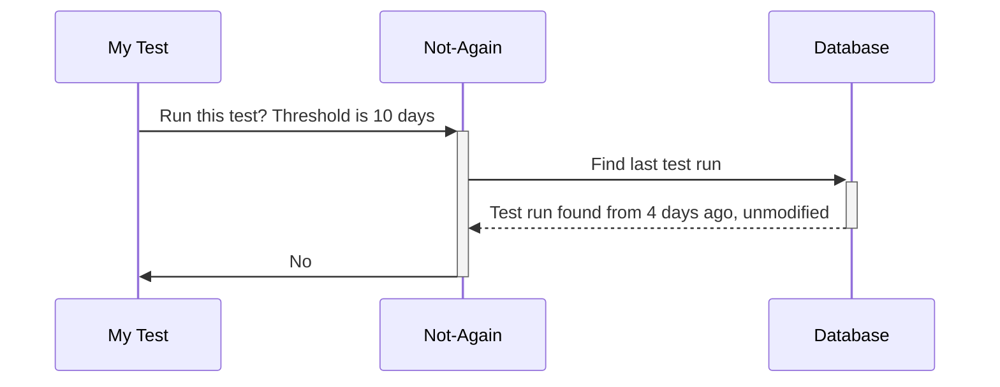
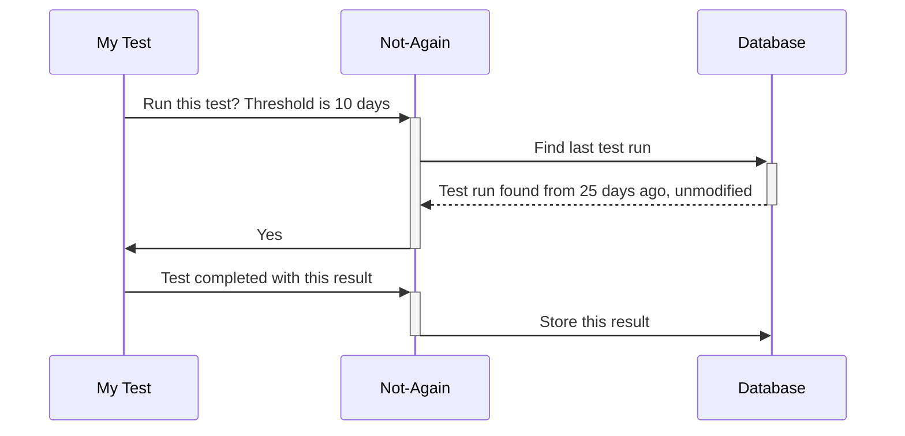
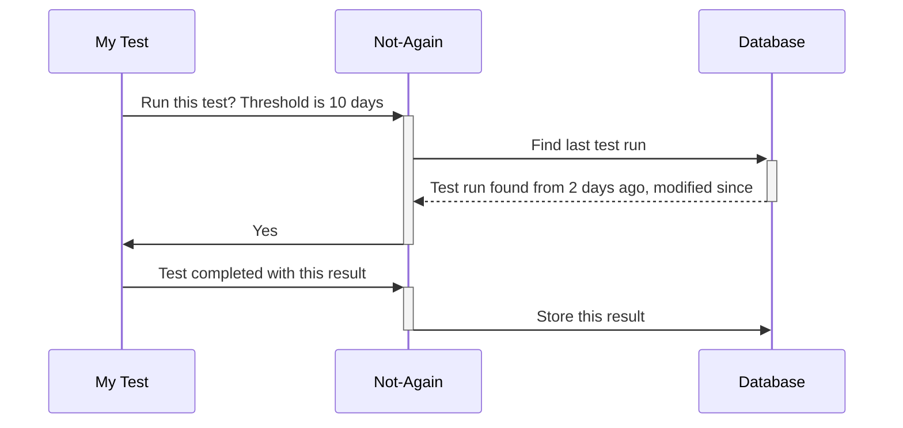

# not-again

[Docker image](https://hub.docker.com/repository/docker/gman82/not-again-api)

## Summary
This is a very simple, lightweight API that can be set up to persist test runs in an (SQL Server) database.

Although written with plugins for C#, the API itself is agnostic and can accept check and result submissions from any language / technology.

When integrated with your test project, the API will be queried before each test is run to determine whether or not it _should_ be run, based on the criteria you have defined.

In CI/CD pipelines and / or large-scale automated test suites, this tool can be useful in minimising continual 're-running' of long tests that are deemed fairly reliable.

For example, you may have several long-running tests that block out the rest of your CI/CD test pipeline, or length the overall testing step(s) by an order of magnitude.

Using the Not-Again API, you could conditionally run the test(s) such that:
* If a test has run in the past X days, and passed, then do not re-run it
* If it has been modified since the last run, then re-run it, regardless
* Otherwise just re-run it

### Examples
#### Example - first test run

#### Example - subsequent (fresh) test result run

#### Example - subsequent (stale) test result run

#### Example - test result run that has been modified
